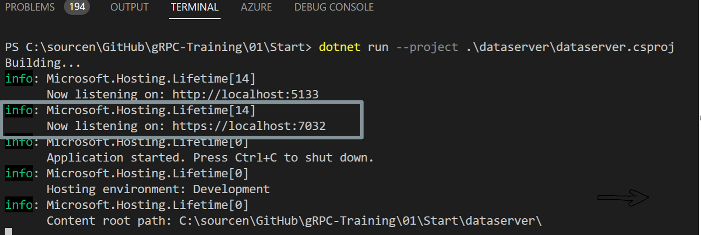
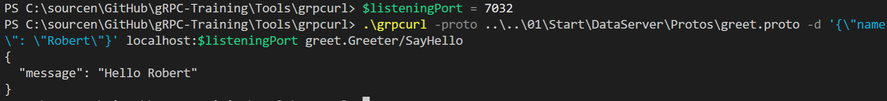

# Chapter 01 Goal
Goal of chapter 01 is the creation of a gRPC server using dotnet core 6.0. dotnet core 6.0 provides a project template which creates a simple gRPC server using ASP.NET core. 

# Excercise
## Change folder
1. Change working directory
Open a VS Code terminal window and ensure that you're in the source code root folder. You should see folders like 01, 02, 03 etc.

2. Change the working directory to .\01\Start: 

        Set-Location .\01\Start

## Create and run gRPC server
1. Create a new ASP.NET Core project named DataServer by executing:  

        dotnet new grpc -o DataServer

    to create a new ASP.NET Core project which provides basic gRPC functionality. 

2. Run newly created ASP.NET Core project 

        dotnet run --project .\DataServer\DataServer.csproj

    Remember the port which the ASP.NET server uses to listen for incoming https traffic. 7032 in the following example: 

        

## Test gRPC server
### gRPC Call
gRPC uses a binary, non human readable format to exchange information between communication partners. Therefore, unlike REST, a browser cannot be used to test the gRPC server and call a function from the server. 

[grpcurl](https://github.com/fullstorydev/grpcurl) can be used as client to call functions from a gRPC server. 

grpcUrl takes 2 flags:
- -proto: ProtoBuf contract file implemented by the gRPC server. [Details in Chapter 02](/02/README.md)
- -d: data to be send to gRPC server

and two parameter:
- Url of the gRPC server (Replace 7032 with the remembered port number from the previous step)
- RPC to call (Package/Service/RPC)

        $listeningPort = 7032
        Set-Location .\Tools\grpcurl\
        .\grpcurl -proto ..\..\01\Start\DataServer\Protos\greet.proto -d '{\"name\": \"Robert\"}' localhost:$listeningPort greet.Greeter/SayHello

### Expected result
  

