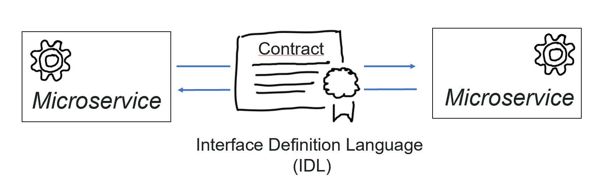
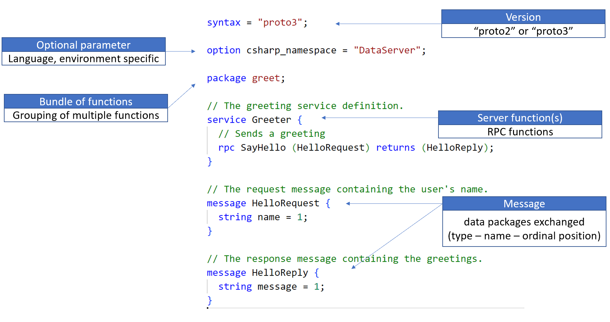
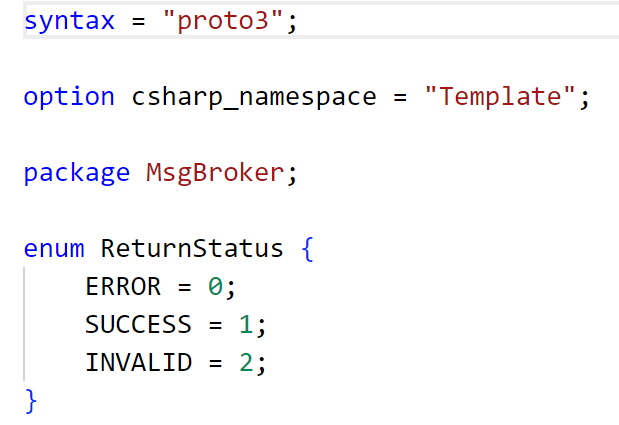

# Chapter 02
Introduction into ProtocolBuffers as Interface Definition Language (IDL) for contracts between communication partners.

## Protocol Buffers
gRPC implements a contract first pattern. It uses [Protocol Buffers (ProtoBuf)](https://developers.google.com/protocol-buffers/) as Interface Definition Language (IDL) to define contracts between communication partners like micro services. 
  

## Example

Protobuf provides a human readable syntax to define interfaces: 
  

## Extensibility
Protobuf can be easily exgtended with user defined types or enums: 

  
