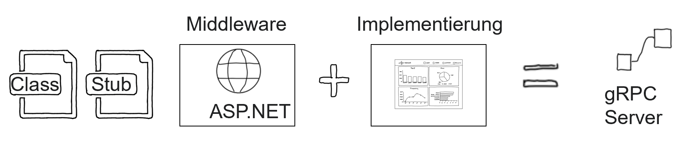

# Chapter 03
Introduction to using the protoc compiler to create class definitions and function stubs. Developing a ASP.NET Core based gRPC server.

## Overview 

The protoc compiler can be used create function stubs and class defintions out of the ProtoBuf file:

  

Unlike class defintions, function stubs aren't directly created by the protoc compiler. For c# the plugin grpc_csharp_plugin.exe can be used to create function stubs. The plugin creates ASP.NET Core stubs. 

# Excercise

Create c# classes and ASP.NET core functions stubs based on the ProtoBuf file [greet.proto](.Start/DataServer/Protos/greet.proto). 

## ProtoBuf compilation
You can use the prepared PowerShell script [CompileProtoStartDataServer.ps1](./Start/CompileProtoStartDataServer.ps1). 

The script will create: 
- [Function stubs](./End/DataServer/Protos/GreetGrpc.cs)
- [c# classes](./End/DataServer/Protos/Greet.cs)  

## ASP.NET core 
Add the necessary ASP.NET core middleware and the implementation of the function stub to a c# project to create a full functional gRPC server:

  
- Create a default [ASP.NET core Program.cs](./End/DataServer/Program.cs) file and enable gRPC support by adding the following two lines: 

        ...
        builder.Services.AddGrpc();
        ...
        app.MapGrpcService<GreeterService>();

- Create a  [class](./End/DataServer/Services/GreeterService.cs) named `GreeterService.cs`,let it inherit from `Greeter.GreeterBase` and implement the custom RPC functionality. 

Don't forget adding the necessary [gRPC nuget packages](./End/DataServer//DataServer.csproj). 

