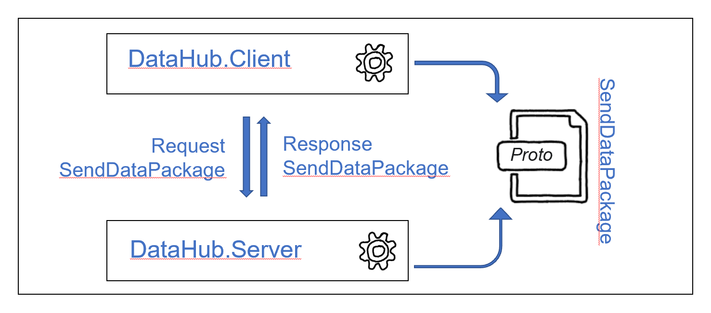
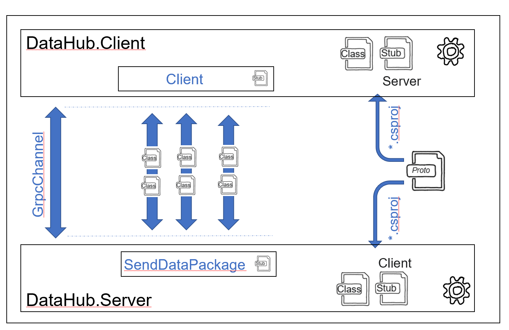

# Chapter 04
## Overview
Introduction of a simplified application (DataHub Server & DataHub Client).

  

you can find in the  [folder](./End/DataHub/) two c# applications: 
- [DataHub.Client](./End/DataHub/DataHub.Client/): A simple c# console application which can call RPC functions from 
- [DataHub.Server](./End/DataHub/DataHub.Server/): A simple ASP.NET core server which implements the RPC functions

Make yourself familiar with the [client](./End/DataHub/DataHub.Client/Program.cs) code. 

Establishing a communication channel, a so called GrpcChannel from a client to a server is a costy activity. Therefore a GrpcChannel can be reused for multiple gRPC calls.

  

The protoc compiler has created a function stub Ingest.IngestClient which can be used to instantiate a Ingest.Ingest client object. 
    
    Ingest.IngestClient client = new Ingest.IngestClient(grpcChannel);

# Excercise

- Please make yourself familier with the [client code](./End/DataHub/Client) and finalize the project in the ["start folder"](./Start/DataHub/) accordingly.

