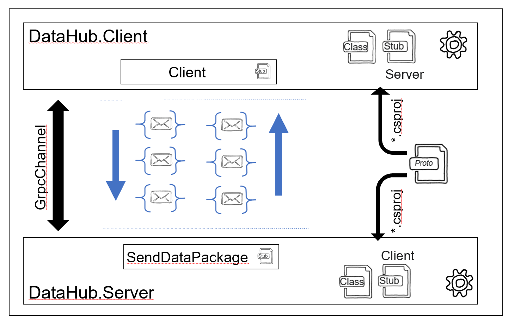
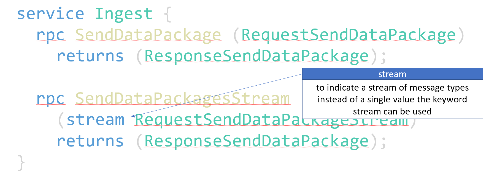

# Chapter 05
Data streaming with gRPC. Bi-direktional streaming from client to server and server to client. 

## Overview
gRPC provides functionality to allow bi-directional streaming of data from the client to the server and vice versa. 

  

## Protobuf
To indicate a stream of ProtoBuf messages the keyword `stream` can be used within the ProtoFile

  

The protoc compiler will create appropriate c# function stubs to retrieve/send data as stream. E.g., a `IServerStreamWriter` is used within the DataHub.Server to provide a stream of ProtoBuf messages to clients.

[Server (Data Egress)](./End/DataHub/DataHub.Server/Services/EgressService.cs): 

    public override async Task GetDataPackagesStream(RequestGetDataPackage request, IServerStreamWriter<ResponseGetDataPackageStream> responseStream, ServerCallContext context )
    {
        while (!context.CancellationToken.IsCancellationRequested)
        {
            ResponseGetDataPackageStream response = new ResponseGetDataPackageStream() {
                IsSuccess = true,
                LastError = "",
                TrackingGuid = request.TrackingGuid, 
                TagName = request.TagName, 
                TagValue = DateTime.UtcNow.Ticks.ToString()
            };
            await responseStream.WriteAsync(response);
            await Task.Delay(TimeSpan.FromSeconds(1));
        }  
    }

[Client (Server Data Egress)](./End/DataHub/DataHub.Client/Program.cs)

    //Egress Data
    Egress.EgressClient egressClient = new Egress.EgressClient(grpcChannel); 
    RequestGetDataPackage egressRequest = new RequestGetDataPackage(){
        TagName = "SomeTagName",
        TrackingGuid = Guid.NewGuid().ToString(),
    };

    CancellationToken cancellationToken = new CancellationTokenSource(TimeSpan.FromSeconds(60)).Token;
    using var dataPackageStream = egressClient.GetDataPackagesStream(egressRequest);
    try {
        await foreach(var dataPackage in dataPackageStream.ResponseStream.ReadAllAsync(cancellationToken))
        {
            if (dataPackage.IsSuccess)
            {
                Console.WriteLine($"{dataPackage.TrackingGuid}");
            }
        }
    } catch (RpcException exception) {
        Console.WriteLine($"{exception.Message}");
    }

# Excercise

- Please make yourself familier with the [server code](./End/DataHub/DataHub.Server/Services/EgressService.cs) and finalize the client and server project in the ["start folder"](./Start/DataHub/) accordingly.
