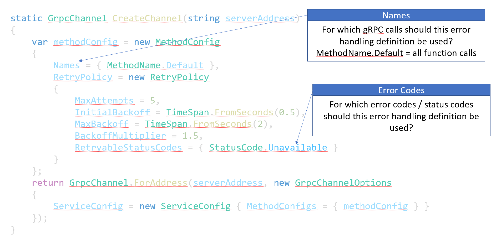

# Chapter 06
Additional c# gRPC functionalities:
-Server Reflection 
- Transient Fault Handling
- Comparison REST <-> gRPC

## Server Reflection
gRPC is using a contract first approach to allow communication between services (client <-> server, microservice communication etc.).

  

Sometimes client might not know which ProtoBuf version a server is using. c# provides out of the box functionality which allows a server to inform clients about the ProtoBuf contracts it is supporting

The nuget package `grpc.aspnetcore.server.reflection` provides this functionality: 

      <ItemGroup>
        <PackageReference Include="Grpc.AspNetCore" Version="2.40.0" />
        <PackageReference Include="grpc.aspnetcore.server.reflection" Version="2.42.0" />
    </ItemGroup>

Within [Program.cs](./Start/DataHub/DataHub.Server/Program.cs) `AddGrpcReflection()` and `MapGrpcReflectionServices()` need to be added.

    ...
    builder.Services.AddGrpcReflection();
    var app = builder.Build();
    ...
    if (app.Environment.IsDevelopment()) {
        app.MapGrpcReflectionService(); 
    }

## Transient Error Handling
.net core provides functionality to address transient error like DNS hickups, temporary lost of connectivity etc. Transient error handling can be defined during the creation of a `GrpcChannel` opject: 

  

# Excercise
Make yourself familiar with the [code](./Start/DataHub/DataHub.Client/Program.cs) and implement transient error handling. 