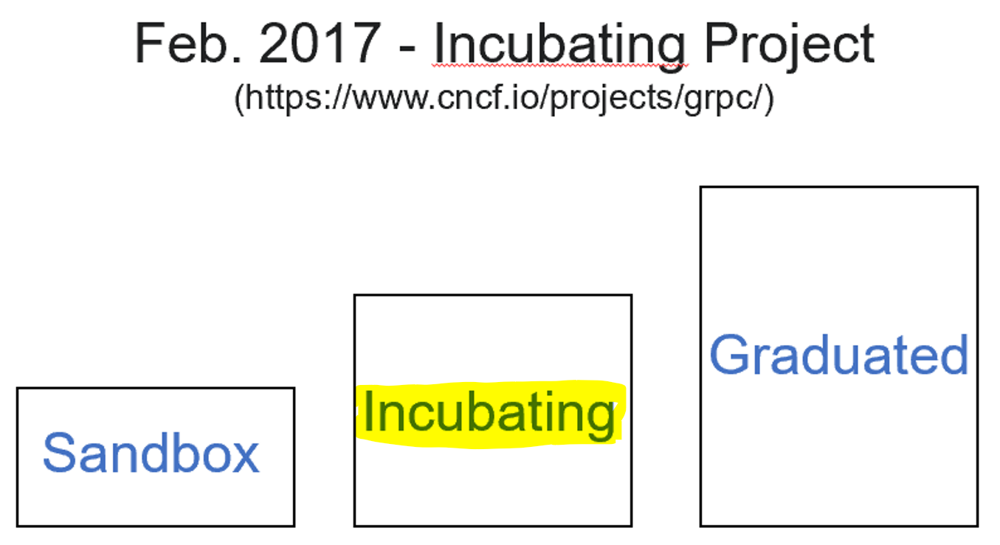

# gRPC Masterclass (with .NET Core & C#)
## gRPC Intro
### Overview
gRPC was accepted in Feb. 2017 as [Incubating Project](https://www.cncf.io/project/grpc) by the [Cloud Native Computing Foundation](https://www.cncf.io/). 

gRPC is becoming more and more popular in OSS as well as enterprise applications. Especially in microservices based architectures the use of gRPC is gaining popularity. 
### Training
This training provides an introduction to using gRPC in own projects by using .NET Core 6.0. 

## Training Structure
- Start: folder for own experiments/trainings. 
- End: folder with a full functional example.
- Root: In the root folder of the specific chapters are PowerShell script files with step-to-step instructions. 
### Tools 
Tools used in the training: 
- [.NET Core 6.0 (Runtime + SDK)](https://dotnet.microsoft.com/en-us/download)
- [Visual Studio Code](https://code.visualstudio.com/Download) 
- [VS Code Extension - Dotnet Tools C#](https://marketplace.visualstudio.com/items?itemName=ms-dotnettools.csharp)
- [VS Code Extension - vscode-proto3](https://marketplace.visualstudio.com/items?itemName=zxh404.vscode-proto3)
- [grpcurl](https://github.com/fullstorydev/grpcurl)
- [protoc Compiler](https://grpc.io/docs/protoc-installation/)
- [protoc Compiler - C# plug-in (nuget)](https://nuget.info/packages/Grpc.Tools/2.46.3)

### gRPC Intro
A brief introduction to the basics and concepts of gRPC. [Intro](./Intro/README.md) 

### Chapter 01
Building a first gRPC server using .NET Core tooling and ASP.NET Core/C#
[Chapter 01](./01/README.md)

### Chapter 02
Introduction into ProtocolBuffers as Interface Definition Language (IDL) for contracts between communication partners.
[Chapter 02](./02/Readme.md)

### Chapter 03
Introduction to using the protoc compiler to create class definitions and function stubs. Developing a ASP.NET Core based gRPC server. 
[Chapter 03](./03/README.md)

### Chapter 04
Introduction simplified application (DataHub Server & DataHub Client).
[Chapter 04](./04/README.md)

### Chapter 05
Data streaming with gRPC. Bi-direktional streaming from client to server and server to client. 
[Chapter 05](./05/README.md)

### Chapter 06
Advanced gRPC Topics
- Transient Fault Handling
- Server Reflection 
- Comparison REST <-> gRPC
[Chapter 06](./06/README.md)
